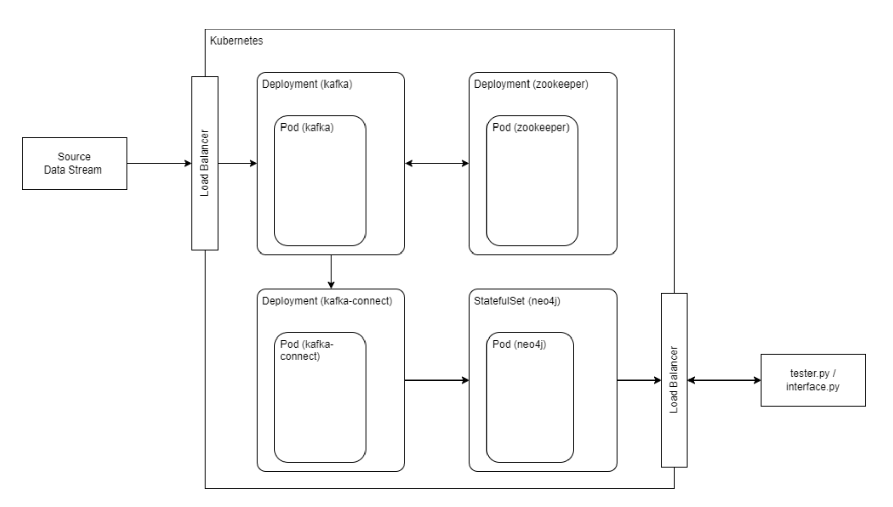

# Kafka – Neo4j Streaming Connector

A fault-tolerant, scalable streaming pipeline that ingests JSON events from Apache Kafka and writes them to a Neo4j graph database. Deployed via Docker containers on a Kubernetes cluster.

---

## 🚀 Features

* **High-throughput ingestion** from Kafka topics
* **Custom connector** mapping JSON payloads to Neo4j nodes & relationships
* **Dockerized** for consistent builds & environment management
* **Kubernetes deployment** for scalability & high availability
* **Idempotent writes** with retry logic under backpressure
* **Centralized logging & metrics** for observability

---

## 📐 Architecture Diagram


*Figure: End-to-end streaming pipeline*

---

## 🛠️ Prerequisites

* Docker (v20+)
* Kubernetes cluster (v1.24+) with `kubectl` configured
* Helm (v3+)
* Apache Kafka & Zookeeper (deployed or hosted)
* Neo4j Enterprise Edition (for Kafka connector compatibility)

---

## ⚙️ Configuration Files

| File                         | Description                                                   |
| ---------------------------- | ------------------------------------------------------------- |
| `zookeeper-setup.yaml`       | Zookeeper deployment & service                                |
| `kafka-setup.yaml`           | Kafka broker & topic definitions                              |
| `kafka-neo4j-connector.yaml` | Kafka Connect connector config for Neo4j ingestion            |
| `sink.neo4j.json`            | JSON schema mapping for nodes & relationships                 |
| `neo4j-service.yaml`         | Kubernetes Service for Neo4j                                  |
| `neo4j-values.yaml`          | Helm values for Neo4j chart (credentials, resources, plugins) |

---

## 🐳 Docker Setup

1. **Build the connector image**

   ```bash
   docker build -t myorg/kafka-neo4j-connector:latest .
   ```
2. **Verify image**

   ```bash
   docker images | grep kafka-neo4j-connector
   ```

---

## 🐍 Python Producers

* **`data_producer.py`** — reads local CSV/JSON data and publishes to Kafka topic
* **`interface.py`** — batch-sends synthetic events for testing & backpressure simulation

```bash
# Example: Produce sample events
python3 data_producer.py --topic my-topic --file sample_events.json
```

---

## 🚢 Kubernetes Deployment

1. **Deploy Zookeeper & Kafka**

   ```bash
   kubectl apply -f zookeeper-setup.yaml
   kubectl apply -f kafka-setup.yaml
   ```
2. **Deploy Neo4j**

   ```bash
   helm repo add neo4j https://neo4j.github.io/helm-charts
   helm install graphdb neo4j/neo4j -f neo4j-values.yaml
   kubectl apply -f neo4j-service.yaml
   ```
3. **Deploy Kafka Connect with Neo4j Connector**

   ```bash
   kubectl apply -f kafka-neo4j-connector.yaml
   ```
4. **Verify pods & services**

   ```bash
   kubectl get pods
   kubectl get svc
   ```

---

## 🔍 Observability & Monitoring

* **Logs** — aggregated via Kubernetes logging driver
* **Metrics** — exposed on Kafka Connect JMX endpoint; scrape with Prometheus
* **Dashboards** — visualize throughput and backpressure in Grafana
